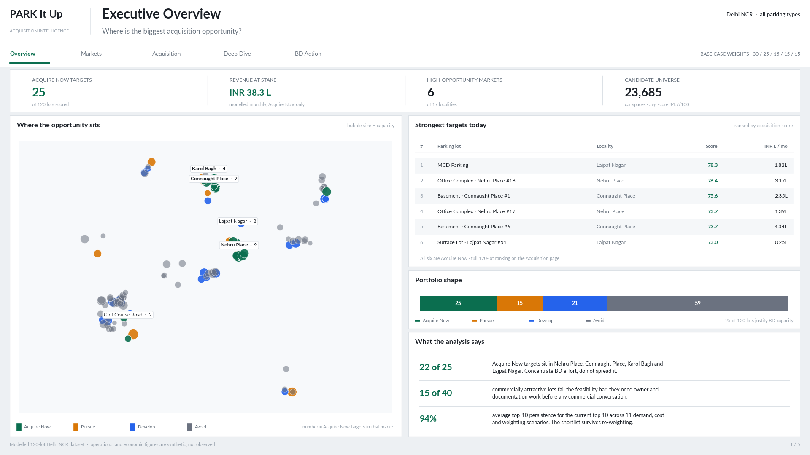
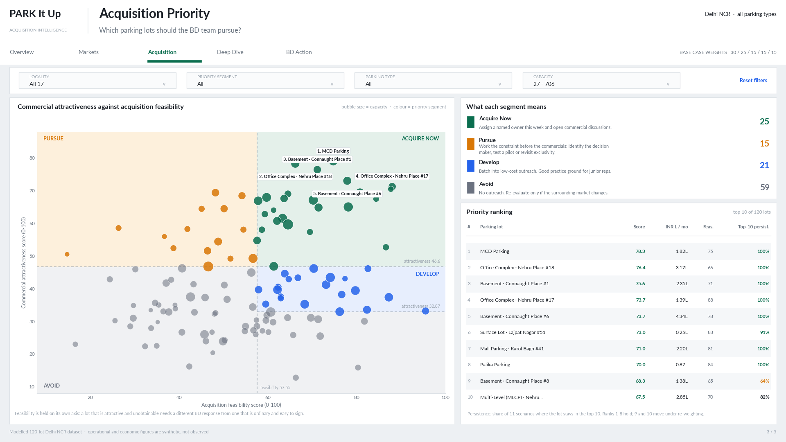

# PARK It Up Acquisition Intelligence

**A decision-support system for parking network expansion.**

> If a parking platform can only approach a limited number of operators, which
> parking lots should the business development team prioritise for acquisition —
> and why?



---

## Executive summary

A parking platform grows by signing lots, and business development capacity is
the binding constraint: a team can sustain perhaps a dozen serious negotiations
at once against thousands of candidate facilities in Delhi NCR. This project
builds the prioritisation layer that decision needs.

It takes 120 real candidate parking locations sourced from OpenStreetMap across
17 Delhi NCR micro-markets, models the operational and commercial layer that no
outsider can observe, and scores every lot on five dimensions a BD manager
actually trades off — demand, revenue potential, competitive whitespace, network
fit, and how realistically the owner can be signed.

The output is not a leaderboard. It is a ranked shortlist of **25 lots worth
active BD capacity out of 120**, concentrated in a handful of micro-markets, each carrying
its own reason codes and a named constraint to resolve. Every score decomposes
into the variables that produced it, and the analysis reports honestly which
parts of the ranking survive a change of assumptions and which do not.

PostgreSQL and SQL own the analytics, Python owns the scoring engine and the
validation suite, Power BI is the decision surface. Deliberately no machine
learning — with 120 lots and no acquisition outcomes to learn from, a transparent
weighted score that can be defended line by line beats a model that cannot.

**Honesty statement, because it is load-bearing rather than a disclaimer.** The
author previously interned at PARK It Up. This repository contains no
confidential information. The parking locations and geography are real and
publicly verifiable; occupancy, revenue, tariffs, commission, owner posture, the
platform's own footprint and the entire BD pipeline are modelled, labelled
synthetic at column, table and document level, and never presented as findings
about the real world.

---

## Business problem

PARK It Up is a parking technology platform operating in Delhi NCR. It does not
own parking capacity. It partners with existing operators — mall managements,
resident welfare associations, hospitals, private companies, municipal bodies —
to digitise their lots with bookings, digital payment and occupancy visibility,
and earns a commission on bookings originated through the platform.

The constraint that makes this an analytical problem is bandwidth. The question
is not whether a given lot is worth having; almost any lot is worth having on
generous enough terms. The question is which lots deserve the next dozen
conversations.

In practice this prioritisation is usually done by proximity, familiarity and
whoever answers the phone, which produces a network shaped by accident rather
than intent.

## Why this problem matters

Three reasons, in order of how much money they represent.

**Wasted BD capacity is the largest hidden cost in early-stage expansion.** A rep
who spends three weeks on an owner who was never going to sign has not lost a
deal — they have lost three weeks of the deals they did not open. At roughly 20
serious conversations a month, choosing the wrong 20 costs a quarter.

**Network shape compounds.** Lots signed by accident cluster where the team
happens to have contacts, leaving demand corridors uncovered while two sites
cannibalise each other 300 m apart. Coverage decisions made now determine which
markets are defensible in two years.

**Unexplained prioritisation cannot be argued with.** A BD lead who cannot say
why one lot outranks another cannot be challenged, corrected, or improved. Making
the reasoning explicit is what turns target selection from a habit into a process
someone can disagree with productively.

---

## Solution

An acquisition intelligence framework with three properties, each chosen against
a specific failure mode.

**The output is a decision, not a score.** Every lot lands in one of four action
segments with an attached instruction. A ranked list invites the question "so how
far down do we go?", which has no answer.

**Every score decomposes into reasons.** "Lot 47 scores 78" is useless in a
negotiation. "Lot 47 scores 78, driven by strong demand and thin nearby supply,
held back by an inaccessible decision maker" tells a rep what to prepare for. The
pillar contributions and reason flags are stored, not recomputed for display.

**Robustness is reported, not hidden.** The analysis states which recommendations
survive re-weighting and which do not, on the dashboard page rather than in an
appendix.

---

## Analytical framework

```text
        Demand Potential          30%   ─┐
        Revenue Potential         25%    │
        Competition Opportunity   15%    ├──►  Acquisition Score  (0–100)
        Strategic Fit             15%    │
        Acquisition Feasibility   15%   ─┘

        ┌──────────────────────────────────────────────────────────┐
        │  Attractiveness axis          ×    Feasibility axis      │
        │  (Demand, Revenue,                 (owner readiness,     │
        │   Competition, Strategic Fit)       cost, complexity)    │
        └──────────────────────────────────────────────────────────┘
                                  │
                                  ▼
              ACQUIRE NOW · PURSUE · DEVELOP · AVOID
```

| Pillar | Weight | What it measures |
|---|---|---|
| **Demand Potential** | 30% | Latent parking demand around the lot: land use, transit proximity, POI density, observed occupancy pressure |
| **Revenue Potential** | 25% | Expected economic value to the platform: capacity, achievable utilisation, tariff, dwell time, commission |
| **Competition Opportunity** | 15% | Favourability of local supply — high where demand exists but competing or already-digitised supply is thin |
| **Strategic Fit** | 15% | Contribution to network strategy: coverage gaps, cluster extension, cannibalisation risk |
| **Acquisition Feasibility** | 15% | Realistic ease of closing: owner willingness, digital readiness, documentation, decision-maker access, cost, complexity |

The weights are **business judgement made before scoring, not fitted to the
output**. What makes them defensible is that their influence was measured rather
than assumed. Because the pillars have different spreads, nominal weight is not
effective weight: Demand carries **44.7%** of the variance in the composite and
Competition only **8.1%**. The ranking was then re-run under demand-heavy,
revenue-heavy, feasibility-heavy and equal-weight alternatives — see
[Key findings](#key-findings).

**Feasibility is held on its own axis.** This is the most important design
decision in the framework. A lot that is wonderful and unobtainable requires a
completely different response from one that is ordinary and easy to sign;
averaging them into a single number produces identical scores and hides exactly
the distinction the BD team needs.

| Segment | Condition | Lots | BD action |
|---|---|---|---|
| **ACQUIRE NOW** | Attractive and closeable | 25 | Assign a named owner this week; open commercial discussions |
| **PURSUE** | Attractive but constrained | 15 | Work the blocker before the commercials — find the decision maker, test a pilot, revisit exclusivity |
| **DEVELOP** | Moderately attractive, easy to close | 21 | Batch into low-cost outreach; suitable for junior reps |
| **AVOID** | Outside the action bands | 59 | No outreach; revisit only if the market or owner posture changes |

Segmentation uses **three** thresholds, not a 2×2 quadrant, all calibrated from
the observed score distribution rather than set by hand: high attractiveness at
46.66 (67th percentile), a Develop attractiveness floor at 33.42 (33rd
percentile), and a feasibility floor at 57.55 (median). The floor matters — a
plain 2×2 wash would colour genuinely unattractive but easy-to-sign lots as
Develop and send reps at them. A regression test asserts it cannot.

### Why no machine learning

A decision, not an omission. Supervised learning needs labelled outcomes — lots
approached that either converted or did not. None of these 120 lots has been
approached, so there is no target variable. Fitting a model to synthetic data
would learn the generator's parameters and present that as a finding, which is
the worst available outcome because it would look sophisticated and mean nothing.

The moment real acquisition outcomes exist, this changes: feasibility becomes a
genuine classification problem with a real target, and that is the first item on
the [real-data roadmap](documentation/future_improvements.md).

---

## Data

The project mixes publicly sourced and modelled data and keeps the two rigorously
distinguishable. Provenance is recorded at table, row and field level, and a
`data_lineage` register classifies every one of the 117 source columns as
`PUBLIC`, `DERIVED`, `SYNTHETIC`, `ASSUMED` or `CONFIG`.

| Class | Contents | Volume |
|---|---|---|
| **Public** | Parking identities, coordinates, OSM element references, metro/POI/transit/competitor features — from a hash-verified OpenStreetMap snapshot | 120 lots, 3,518 OSM elements |
| **Derived** | Haversine distances, POI counts by radius, competitor counts, supply-pressure and whitespace proxies, all pillar scores | ~40 fields |
| **Synthetic** | Occupancy, entries, bookings, cancellations, dwell time, gross revenue, tariffs, commission, onboarding cost, owner attributes and posture, the platform's hypothetical live network, the entire BD funnel | 43,800 daily rows, 5,760 hourly rows, 72 owners, 120 leads, 385 funnel events |
| **Assumed** | Market demand priors, micro-market classification, density bands, all scoring weights and scenario multipliers | 25 documented assumptions |

**Geographic coverage.** Delhi NCR only, bounded at latitude 28.30–28.95 and
longitude 76.80–77.60. 17 micro-markets spanning CBD, commercial, retail high
street, IT/office park, residential, transit hub, mixed use and
hospital/institutional. Between 3 and 11 candidate lots per market. Observation
window 2025-08-01 to 2026-07-31.

**The rule that matters most:** no figure derived from synthetic data is presented
as a finding about the real world. Relative rankings are defensible as a
demonstration of method. Absolute rupee forecasts are not, and the project does
not make them.

Personal contact tags — phone numbers and email addresses that OSM mappers attach
to small-business objects — are stripped from the snapshot at write time. They are
personal data about identifiable third parties with no analytical use here, and a
test asserts the committed snapshot stays clean. `operator` is deliberately
retained for ODbL attribution.

---

## Architecture

```text
  OpenStreetMap Overpass / Nominatim
            │  one bounded collection, then cached offline
            ▼
  data/external/  ── hash-verified snapshot (committed; the build never calls an API)
            │
            ▼
  python/etl/     ── cleaning · geo derivation · relationship-aware synthetic generation
            │        30 structural and business-rule checks
            ▼
  data/raw/ → data/processed/   ── 12 database-ready CSVs + build manifest
            │
            ▼
  PostgreSQL      ── 21-table star schema · 101 CHECK constraints · 22 foreign keys
            │        35-rule data-quality catalogue
            ├──►  sql/analysis/component_scores.sql   ── the five pillars, every
            │                                            intermediate measure exposed
            ▼
  python/analysis/scoring_engine.py   ── 16 scenarios · ranking · segmentation
            │                            base case reconciled against the SQL view
            ├──►  python/model_validation/   ── monotonicity · stress · sensitivity
            │
            ▼
  data/powerbi/   ── portable star-schema extracts, reconciled to the analytical layer
            │
            ▼
  Power BI        ── 5-page decision dashboard
```

Two architectural rules do the heavy lifting.

**SQL owns the pillar definitions; Python owns scenarios and validation.** That
means Demand and Revenue genuinely exist in both places, because a scenario
multiplier cannot be expressed in a baseline view. So drift is made impossible
rather than merely discouraged: every run reconciles Python's base-case pillars
against the SQL view column by column and fails the build if any differs by more
than 1e-6. In the base case all multipliers are 1.0, so Python must reproduce SQL
exactly. That single check covers roughly a dozen constants shared between the two
files.

**Derived values never live in raw tables.** `acquisition_difficulty` was removed
on these grounds during design — it is the *output* of the Feasibility pillar, and
storing it as an input would make the scoring circular. The twelve architecture
decisions are recorded in
[`architecture_decisions.md`](documentation/decisions/architecture_decisions.md).

---

## Tech stack

| Layer | Choice | Reasoning |
|---|---|---|
| Database | PostgreSQL 14+ (validated on 17.5) | `CHECK` constraints, generated columns and partial unique indexes let business rules live in the schema rather than in application code |
| Analytics | PostgreSQL SQL | The analysis layer is SQL-first — multi-CTE scoring views, window functions, percentile anchors |
| Engine | Python 3.10+, pandas, numpy | Synthetic generation, scenario scoring, validation suite |
| Visualisation | Power BI | One business-facing surface, consuming the analytical layer rather than recomputing it |
| Charts | matplotlib | Exploratory work and the rendered dashboard previews only |
| Geospatial | haversine in numpy | No PostGIS, no GeoPandas. The geometry needed is point-to-point distance — about fifteen lines — and the dependency would complicate installation for no analytical gain |

`requirements.txt` declares ten packages and documents **eight that were evaluated
and rejected**, including scikit-learn, GeoPandas, plotly and Faker, each with the
reason. Dependencies are justified rather than accumulated.

---

## Dashboard

Five pages, one decision each. Rendered from the actual project data — Power BI
Desktop is unavailable on the development host, so page design, field mapping,
number formatting and visual hierarchy are made reviewable by rendering the same
measures onto the same 16:9 canvas. Every figure shown is read from
`data/powerbi/*.csv`, which is reconciled against the PostgreSQL views.

| Page | Question it answers | Preview |
|---|---|---|
| Executive Overview | Where is the biggest acquisition opportunity? | [view](dashboard/powerbi/screenshots/page_01_executive_overview.png) |
| Market Opportunity | Which markets deserve attention? | [view](dashboard/powerbi/screenshots/page_02_market_opportunity.png) |
| Acquisition Priority | Which lots should the BD team pursue? | [view](dashboard/powerbi/screenshots/page_03_acquisition_matrix.png) |
| Parking Deep Dive | Why is this lot attractive? | [view](dashboard/powerbi/screenshots/page_04_parking_deep_dive.png) |
| BD Strategy | How does this become BD action? | [view](dashboard/powerbi/screenshots/page_05_bd_strategy.png) |



The acquisition matrix is the page that carries the core idea: attractiveness and
closeability are different axes, and the four regions are four different BD
responses.

**Every KPI reconciles.** Lot count, capacity, average occupancy, modelled
revenue, high-priority count, average score, all five pillar means, every rank and
every segment assignment must match the analytical layer to rounding tolerance,
and component contributions must sum to the composite for every lot. This is
enforced by tests, not asserted in prose. A mechanical layout audit additionally
fails the build if any chart's labels escape the card that hosts it.


---

## Key findings

Findings about **this modelled dataset and this method**. The operational and
commercial layer is synthetic, so none of these is a claim about real Delhi
parking economics.

**Opportunity is heavily concentrated.** All 25 priority targets sit in six of the
17 micro-markets, and 22 of them in only four. This is the strongest structural
result and it is a resource-allocation conclusion, not a claim about any locality:
when opportunity concentrates this hard, saturating a handful of markets beats
spreading a small team across seventeen.

**A fifth of the portfolio is attractive but not closeable.** 15 of the 40
commercially attractive lots fall below the feasibility floor. On a single
composite ranking they would be indistinguishable from Acquire Now targets, and
approaching them with a standard commercial pitch would waste the meeting. This is
the segmentation earning its keep.

**The ranking has a robust head and an unstable body.** 8 of 120 lots hold top-10
rank in every primary scenario and 2 mostly hold; the other 110 do not. So the
shortlist is a real result and the ordering below rank 10 is not a finding. This
is stated on the dashboard, not in a footnote.

**Segments are less stable than ranks.** Equal-weighting moves only one lot out of
the top 10 but reassigns 18 lots between action segments, because the thresholds
are absolute cuts on a distribution that shifts. Treat the shortlist as robust and
the Develop/Avoid boundary as indicative.

**The shortlist survives re-weighting; the exact weights are not load-bearing at
the top.** The most disruptive scenario is feasibility-heavy at 40%, where rank
correlation with the base case is still 0.925 and 9 of the top 10 hold.
Equal-weighting also keeps 9 of 10, but moves 18 lots between segments — segment
membership is more assumption-sensitive than rank order.

**Rank 1 is not a revenue story.** The top lot leads because it is strong on four
pillars simultaneously rather than exceptional on one; the rank-6 lot gets there
on competitive whitespace and closeability with a mid-range revenue score of 45.8.
Reading only the composite would hide that, which is why the deep-dive page
decomposes it.

**The funnel's most expensive leak is at the end.** Stage conversion holds between
66% and 78% until documents-collected to onboarded, where it drops to 52%.
Late-stage loss means full BD cost incurred and no signature.

**The largest single loss reason is a process problem, not a targeting problem.**
"Owner not decision maker" accounts for 23 of 64 losses — more than a third. A
five-minute qualifying question ahead of a site visit addresses it, and no
scoring model is needed to act on it.

Full recommendations, with each statement labelled *supported* or *illustrative*:
[`recommendations.md`](documentation/business/recommendations.md).

---

## Validation

| Check | Result |
|---|---|
| Automated tests | **54** across configuration, pipeline determinism, scoring, analytics, dashboard extracts and the audit suite |
| SQL data-quality rules | **35** (20 error, 15 warning) executed against PostgreSQL |
| Python structural checks | **30** executed in the pipeline |
| Schema constraints | 101 `CHECK`, 22 foreign keys, 21 primary keys, 15 unique |
| Monotonicity tests | **7 of 7 pass** — each pillar responds in the correct direction to its own driver |
| Adversarial stress cases | **6 of 6 pass** — including a 500-space lot at 5% utilisation landing at rank 100 and Avoid |
| Scenarios | 16 (10 feeding rank stability, 6 supplementary diagnostics) |
| SQL ↔ Python base-case reconciliation | 13 measures × 120 lots, worst absolute difference **1.16e-10** |
| Power BI ↔ analytical layer | all pillar means, ranks and segments match within 2dp rounding |
| BD funnel | recomputed independently from 385 raw event rows; matches the published aggregate exactly |

Monotonicity is the check worth understanding: it verifies that more demand never
reduces the Demand score, more competition never improves Competition
Opportunity, a higher onboarding cost never improves Feasibility, better owner
readiness never reduces Feasibility, a higher tariff never reduces Revenue, and
greater whitespace never reduces Strategic Fit. Those are sign errors a range
check cannot catch.

---

## Limitations

Stated here rather than buried, because a reader who finds these themselves will
discount everything else.

**No ground truth exists.** Nothing here can be validated against actual
acquisition outcomes. The defence is face validity, internal consistency and
sensitivity testing — not predictive accuracy. The honest answer to "how do you
know it works" is: I don't, and the [roadmap](documentation/future_improvements.md)
says exactly what I would need to find out.

**The ranking is only trustworthy at the top.** 110 of 120 lots are top-10
sensitive. Any claim depending on lot #47 outranking lot #52 is unsupportable.

**Circularity risk in the synthetic data.** Occupancy is generated to correlate
with location characteristics, and funnel loss reasons with owner attributes. If
analysis reports that location predicts occupancy, that is the generator being
read back rather than a discovery. The affected questions are flagged as method
demonstration.

**Competitor capacity is unavailable.** It is null for every candidate in OSM, so
the Competition pillar is an honest count-based supply-pressure proxy rather than
a supply-versus-demand ratio. Nothing is imputed.

**Scores are relative and dataset-bound.** 100 is best among the lots modelled,
not best possible, and scores shift when the population changes. Winsorisation
additionally censors 6 of 120 lots at the extremes of the Revenue pillar.

**Distance ignores barriers.** Two lots 400 m from a metro station are not
equivalent if one has a footbridge and the other faces six lanes of traffic.

**Two-wheelers are excluded**, which understates demand most at retail high
streets and hospitals — precisely where two-wheeler share is highest in NCR.

**Commission and deal terms are invented.** They are not PARK It Up figures, are
not derived from any, and support no conclusion about actual platform economics.

**No festival calendar.** Festival effects are large in Delhi retail parking, but
asserting dates from memory would put invented facts into the dataset. An
incomplete calendar was preferable to a wrong one.

The full register of 25 assumptions, each with value, provenance and validation
plan, is in [`assumptions.md`](documentation/assumptions/assumptions.md).

### What this project does not do

It prioritises opportunities. It does not make acquisition decisions. Site
inspection, ownership and title verification, commercial negotiation, legal
review, financial diligence and operational feasibility all sit downstream, and
the model has no visibility into any of them. A model that claimed otherwise
would be caught being wrong the first time a rep visited a site.

---

## Documentation

| Document | Contents |
|---|---|
| [`methodology.md`](documentation/methodology/methodology.md) | Business problem, data architecture, feature strategy, scoring, segmentation, sensitivity plan |
| [`scoring_methodology.md`](documentation/methodology/scoring_methodology.md) | Generated: pillar formulas, normalisation, correlation audit, thresholds, reconciliation and validation results |
| [`recommendations.md`](documentation/business/recommendations.md) | Market, lot, BD-process, data-collection and model recommendations, each labelled supported or illustrative |
| [`future_improvements.md`](documentation/future_improvements.md) | What real PARK It Up data would unlock, ordered by value; and what is deliberately out of scope |
| [`data_dictionary.md`](documentation/methodology/data_dictionary.md) | All 181 schema columns, with CSV supplements for source references and generation logic |
| [`data_generation.md`](documentation/methodology/data_generation.md) | Public source policy, synthetic relationships, validation and reproducibility |
| [`data_profile.md`](documentation/methodology/data_profile.md) | Executed row counts, coverage, distributions, missingness, quality results |
| [`erd.md`](documentation/methodology/erd.md) | Mermaid diagrams, relationship register, business rules enforced in the schema |
| [`assumptions.md`](documentation/assumptions/assumptions.md) | 25 assumptions with values, provenance and validation plans |
| [`business_questions.md`](documentation/business/business_questions.md) | The BD questions the analysis answers, and three categories deliberately out of scope |
| [`architecture_decisions.md`](documentation/decisions/architecture_decisions.md) | Twelve decision records, including the retirement of the second front end |
| [`python_analysis.md`](documentation/methodology/python_analysis.md) | EDA, diagnostics, sensitivity, rank stability, stress tests, dashboard exports |
| [`dashboard_architecture.md`](documentation/business/dashboard_architecture.md) | Five-page specification with KPIs, visuals and measures |

---

## A note on scope

A portfolio project built to demonstrate business reasoning, SQL, data modelling
and explainable metrics. It uses no confidential PARK It Up data. Operator names,
commercial terms, performance figures and the entire BD pipeline are simulated,
and the documentation identifies them as such throughout.

OpenStreetMap data © OpenStreetMap contributors, licensed under the
[Open Database License](https://www.openstreetmap.org/copyright).
