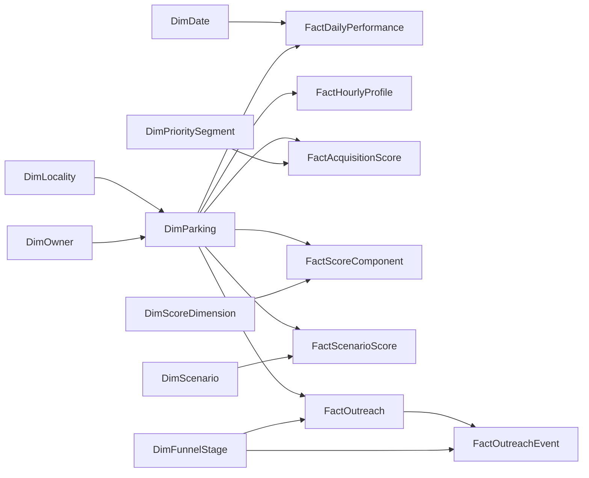

# Relationships and Filter Direction

Create these relationships with **single-direction filtering from the first table to the second**.

| From | To | Cardinality | Active | Purpose |
|---|---|---|---|---|
| `DimLocality[locality_id]` | `DimParking[locality_id]` | 1:* | Yes | Market filters lots |
| `DimOwner[owner_id]` | `DimParking[owner_id]` | 1:* | Yes | Owner filters lots |
| `DimParking[parking_id]` | `FactDailyPerformance[parking_id]` | 1:* | Yes | Lot filters daily facts |
| `DimDate[activity_date]` | `FactDailyPerformance[activity_date]` | 1:* | Yes | Date filters daily facts |
| `DimParking[parking_id]` | `FactHourlyProfile[parking_id]` | 1:* | Yes | Lot filters hourly profile |
| `DimParking[parking_id]` | `FactAcquisitionScore[parking_id]` | 1:* | Yes | Lot context filters base score |
| `DimPrioritySegment[segment_code]` | `FactAcquisitionScore[priority_segment]` | 1:* | Yes | Segment slicer filters base score |
| `DimParking[parking_id]` | `FactScoreComponent[parking_id]` | 1:* | Yes | Lot filters component rows |
| `DimScoreDimension[dimension_code]` | `FactScoreComponent[dimension_code]` | 1:* | Yes | Pillar filters component rows |
| `DimParking[parking_id]` | `FactScenarioScore[parking_id]` | 1:* | Yes | Lot filters scenarios |
| `DimScenario[scenario_id]` | `FactScenarioScore[scenario_id]` | 1:* | Yes | Scenario slicer filters scenario scores |
| `DimPrioritySegment[segment_code]` | `FactScenarioScore[segment_code]` | 1:* | Yes | Scenario segment filter |
| `DimParking[parking_id]` | `FactScenarioComponent[parking_id]` | 1:* | Yes | Lot filters scenario components |
| `DimScenario[scenario_id]` | `FactScenarioComponent[scenario_id]` | 1:* | Yes | Scenario filters component rows |
| `DimScoreDimension[dimension_code]` | `FactScenarioComponent[dimension_code]` | 1:* | Yes | Pillar filters scenario components |
| `DimLocality[locality_id]` | `FactLocalityScenario[locality_id]` | 1:* | Yes | Market filters locality scenarios |
| `DimScenario[scenario_id]` | `FactLocalityScenario[scenario_id]` | 1:* | Yes | Scenario filters locality movement |
| `DimParking[parking_id]` | `FactOutreach[parking_id]` | 1:* | Yes | Lot filters BD lead |
| `DimFunnelStage[stage_id]` | `FactOutreach[furthest_stage_id]` | 1:* | Yes | Stage context for lead reach |
| `DimFunnelStage[stage_id]` | `FactOutreachEvent[stage_id]` | 1:* | Yes | Stage context for event counts |
| `FactOutreach[lead_id]` | `FactOutreachEvent[lead_id]` | 1:* | Yes | Lead header filters its events |

## Date relationship note

`FactOutreach` has both `first_contact_date` and `conversion_date`. Keep `first_contact_date` active only if date slicing of lead creation is required; create the `conversion_date` relationship as inactive and use `USERELATIONSHIP` in a dedicated conversion-date measure. `FactOutreachEvent[event_date]` can have its own active relationship to `DimDate` only if the report needs event-time slicing. Do not create two active relationships from `DimDate` to the same fact.

## Why no bi-directional relationships

Bi-directional filters would allow a performance fact or outreach event to alter the candidate dimension and distort KPI denominators. The few header-detail relationships are intentionally documented; all other paths remain dimension-to-fact.

## Mermaid overview

